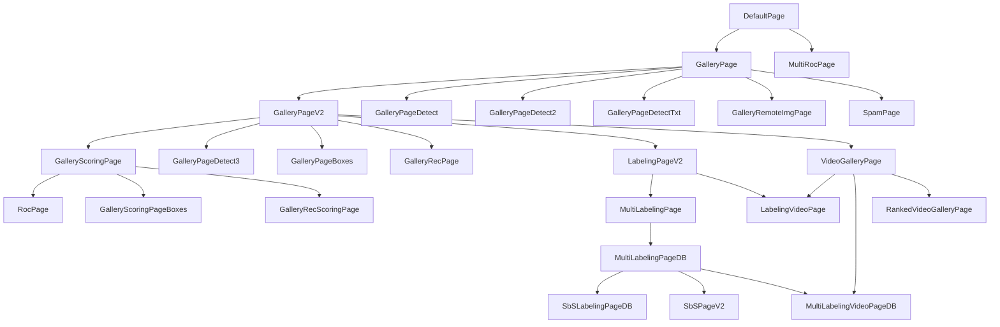

# Streamlit Visualizer

Фреймворк для ускорения процессов, связанных с анализом визуальных моделей: просмотр и фильтрация изображений/видео, визуализация детекций, построение ROC-кривых, разметка данных и оценка качества моделей — всё через конфиги YAML без написания кода.

## Концепция

Анализ визуальных моделей — это итеративный процесс, в котором постоянно приходится:

- смотреть на предсказания модели (галереи изображений и видео);
- фильтровать и сортировать выборки по атрибутам;
- визуализировать детекции (боксы) поверх изображений;
- строить ROC-кривые и сравнивать модели;
- размечать данные (в том числе видео) и сохранять разметку;
- оценивать качество ответов моделей (SbS, ранжирование).

Каждый такой процесс — это, как правило, отдельный скрипт, который нужно писать, отлаживать и поддерживать. **Streamlit Visualizer** решает эту проблему: вместо кода вы описываете страницу конфигом YAML, а фреймворк сам строит нужный интерфейс на базе Streamlit.

Ключевые принципы:

- **Конфиг вместо кода.** Каждая страница — это YAML-файл с полем `_target_` (имя класса) и блоком `cfg` (параметры). Запуск — одна команда.
- **Переиспользование через наследование конфигов.** Базовые конфиги (`__gallery`, `__labeling`, `__v_labeling` и т.д.) можно наследовать и переопределять только нужные поля.
- **Готовые классы под типовые задачи.** Галереи, детекции, ROC, разметка, SbS — всё уже реализовано в [`st_pages.py`](st_pages.py).
- **Быстрый старт.** Достаточно положить CSV/JSON с путями к изображениям и запустить приложение.

## Quick Start

### 1. Установка зависимостей

```bash
pip install -r requirements.txt
```

### 2. Подготовка данных

Фреймворк работает с табличными данными (CSV или JSON), где есть колонка с путями к изображениям/видео (локальными или по URL). Пример структуры CSV:

```csv
img_path,label,score
/path/to/img1.jpg,1,0.92
/path/to/img2.jpg,0,0.31
```

### 3. Базовый конфиг

Создайте файл `configs/my_gallery.yaml`:

```yaml
_target_: st_pages.GalleryPageV2
cfg:
  page:
    title: "My gallery"
    icon: ":eye:"
    description: null

  data_path: /path/to/data.csv   # путь к CSV/JSON с данными
  image:
    path_col: img_path           # колонка с путями к изображениям
    max_size: 640                # ограничение размера изображения

  attributes: null               # колонки для фильтрации
  sorting: null                  # колонки для сортировки
  default_captions: null         # колонки, показываемые под изображением

  format:
    default: "Not chosen"
    col_mapping: null
    col_val_mapping: null

  advanced:
    random_seed:
      value: 42
    images_in_page:
      min_value: 1
      max_value: 100
      value: 50
      step: 1
    images_in_row:
      min_value: 1
      max_value: 5
      value: 5
      step: 1
```

### 4. Запуск

```bash
streamlit run app_master.py --server.port 8501
```

В приложении выберите конфиг из списка внизу страницы. Либо запустите конкретный конфиг напрямую:

```bash
python app.py configs/my_gallery.yaml
```

---

## Примеры использования

Конфиги можно наследовать через блок `defaults` (механизм Hydra). Это позволяет задать общие параметры один раз в базовом конфиге и переопределять только нужные поля в конкретных.

### Галерея изображений — `GalleryPageV2`

Простая галерея изображений с пагинацией, случайным перемешиванием и подписями. Подходит для быстрого просмотра выборки.

<details>
<summary>Базовый конфиг `__gallery.yaml`</summary>

```yaml
_target_: st_pages.GalleryPageV2
cfg:
  page:
    title: "Base gallery page"
    icon: ":eye:"
    description: null

  data_path: ???                # путь к CSV/JSON с данными
  image:
    path_col: img_path          # колонка с путями к изображениям
  attributes: null
  sorting: null
  default_captions: null

  format:
    default: "Not chosen"
    col_mapping: null
    col_val_mapping: null

  advanced:
    random_seed:
      value: 42
    images_in_page:
      min_value: 1
      max_value: 100
      value: 50
      step: 1
    images_in_row:
      min_value: 1
      max_value: 5
      value: 5
      step: 1
```

</details>

<details>
<summary>Пример конфига</summary>

```yaml
defaults:
  - __gallery
  - _self_

_target_: st_pages.GalleryPageV2
cfg:
  page:
    title: "Image gallery"
    icon: ":eye:"
    description: "Простой просмотр изображений"

  data_path: /path/to/data.csv
  image:
    path_col: img_path
    max_size: 640

  default_captions: [label]      # колонки, показываемые под изображением

  advanced:
    images_in_page:
      value: 20
    images_in_row:
      value: 4
```

</details>

### Фильтры, сортировка, подписи и переименование полей — `GalleryPageV2`

Расширенная галерея: фильтрация по атрибутам, сортировка по колонкам, подписи по умолчанию и переименование колонок/значений через `format`.

<details>
<summary>Пример конфига</summary>

```yaml
defaults:
  - __gallery
  - _self_

_target_: st_pages.GalleryPageV2
cfg:
  page:
    title: "Filtered gallery"
    icon: ":eye:"
    description: null

  data_path: /path/to/data.csv
  image:
    path_col: img_path
    max_size: 640

  attributes:
    cols: [label, domain]        # колонки, по которым можно фильтровать

  sorting:
    cols: [score, probability]   # колонки для сортировки
    asc: false                   # порядок по умолчанию (или список для каждой колонки)

  default_captions: [label, score]   # подписи, выбранные по умолчанию

  format:
    default: "Not chosen"
    col_mapping:                 # переименование колонок в интерфейсе
      label: "Метка"
      score: "Скор"
      domain: "Домен"
    col_val_mapping:             # переименование значений колонок
      label:
        0: "Fake"
        1: "Real"
      domain:
        A: "aaa"
        B: "bbb"

  advanced:
    images_in_page:
      value: 16
    images_in_row:
      value: 2
```

</details>

### Детектирование — `GalleryPageDetect3`

Галерея с визуализацией детекций (боксов) поверх изображений. Поддерживает несколько детекторов, пороги по скору, подписи классов и разные форматы боксов.

<details>
<summary>Базовый конфиг `__detect.yaml`</summary>

```yaml
_target_: st_pages.GalleryPageDetect3
cfg:
  page:
    title: "Base detection gallery"
    icon: ":eye:"
    description: null

  data_path: ???                # путь к CSV/JSON с данными
  image:
    path_col: img_path          # колонка с путями к изображениям
    max_size: null

  attributes: null
  sorting: null
  default_captions: null

  det:                          # список детекторов
    - col: ???                  # колонка с боксами
      bboxes_key: null          # ключ внутри dict-значения колонки (если боксы в dict)
      scores_key: null          # ключ со скорами (если боксы в dict)
      labels_key: null          # ключ с классами (если боксы в dict)
      thr: null                 # порог отсечения по скору
      draw_opts:
        mode: xyxy              # формат боксов: xyxy | xywh | ccwh
        color: lime

  format:
    default: "Not chosen"
    col_mapping: null
    col_val_mapping: null

  advanced:
    random_seed:
      value: 42
    images_in_page:
      value: 10
    images_in_row:
      value: 1
```

</details>

<details>
<summary>Пример конфига</summary>

```yaml
defaults:
  - __detect
  - _self_

_target_: st_pages.GalleryPageDetect3
cfg:
  page:
    title: "Detections"
    icon: ":eye:"
    description: null

  data_path: /path/to/detections.json
  image:
    path_col: url
    max_size: null

  attributes:
    cols: [label]
  default_captions: [label]

  det:
    - col: bboxes               # колонка с боксами
      bboxes_key: null
      scores_key: null
      labels_key: null
      thr: 0.5                  # порог отсечения по скору
      draw_opts:
        mode: xyxy
        color: lime
      label_mapping:            # переименование индексов классов
        0: "background"
        1: "stop"
```

</details>

#### Форматы боксов

`GalleryPageDetect3` поддерживает три способа хранения боксов в данных:

1. **Отдельные колонки** — координаты бокса лежат в отдельных колонках таблицы. Задаётся через `cols` (вместо `col`):

   ```yaml
   det:
     - cols: [x1, y1, x2, y2]   # четыре колонки с координатами
       draw_opts:
         mode: xyxy
         color: lime
   ```

2. **Список боксов в колонке** — колонка содержит список боксов, каждый бокс — список из 4 координат (и, опционально, 5-й элемент — класс). Задаётся через `col` + `bboxes_key: null`:

   ```yaml
   det:
     - col: bboxes              # колонка со списком боксов [[x1,y1,x2,y2,cls], ...]
       bboxes_key: null
       with_labels: true        # если в боксе есть 5-й элемент (класс)
       draw_opts:
         mode: xyxy
         color: lime
   ```

3. **Dict с ключами** — колонка содержит dict вида `{"boxes": [...], "scores": [...], "labels": [...]}`. Задаётся через `col` + `bboxes_key`/`scores_key`/`labels_key`:

   ```yaml
   det:
     - col: detection           # колонка с dict
       bboxes_key: boxes        # ключ со списком боксов
       scores_key: scores       # ключ со списком скоров
       labels_key: labels       # ключ со списком классов
       thr: 0.5                 # порог по скору
       draw_opts:
         mode: xyxy
         color: lime
   ```

Поддерживаемые режимы координат (`mode`): `xyxy` (x1,y1,x2,y2), `xywh` (x,y,w,h), `ccwh` (центр, ширина, высота).

### Построение ROC-кривой — `RocPage`

Страница для построения ROC-кривой по колонкам скоров модели. Наследует логику галереи, но основной акцент — на кривой.

<details>
<summary>Базовый конфиг `__roc.yaml`</summary>

```yaml
_target_: st_pages.RocPage
cfg:
  page:
    title: "Base ROC page"
    icon: ":eye:"
    description: null

  data_path: ???                # путь к CSV/JSON с данными
  image:
    path_col: img_path
    max_size: 640

  sorting:
    cols: ${cfg.scoring.cols}   # сортировка по колонкам скоров

  scoring:
    cols: ???                   # колонки со скорами моделей
    label_col: label            # колонка с истинными метками
    roc_title: 'ROC curve'

  default_captions: null

  format:
    default: "Not chosen"
    col_mapping: null
    col_val_mapping: null

  advanced:
    images_in_page:
      value: 16
    images_in_row:
      value: 2
```

</details>

<details>
<summary>Пример конфига</summary>

```yaml
defaults:
  - __roc
  - _self_

_target_: st_pages.RocPage
cfg:
  page:
    title: "ROC curve"
    icon: ":eye:"
    description: null

  data_path: /path/to/scores.csv
  image:
    path_col: img_path
    max_size: 640

  scoring:
    cols: [score_a, score_b]    # колонки со скорами моделей
    label_col: label
    roc_title: 'ROC curve'
```

</details>

### Построение нескольких ROC-кривых — `MultiRocPage`

Страница для построения нескольких ROC-кривых (по подгруппам данных) на одном графике. Полезно для сравнения качества модели на разных подвыборках.

<details>
<summary>Базовый конфиг `__multiroc.yaml`</summary>

```yaml
_target_: st_pages.MultiRocPage
cfg:
  page:
    title: "Base multi ROC page"
    icon: ":eye:"
    description: null

  data_path: ???                # путь к CSV/JSON с данными

  roc:
    label_col: label            # колонка с истинными метками
    score_cols: ???             # колонки со скорами
    group_cols: ???             # колонки-флаги подгрупп (1/0)
    n: 2                        # размер сетки графиков (2x2)
    title: ROC curves
```

</details>

<details>
<summary>Пример конфига</summary>

```yaml
defaults:
  - __multiroc
  - _self_

_target_: st_pages.MultiRocPage
cfg:
  page:
    title: "Multi ROC"
    icon: ":eye:"
    description: null

  data_path: /path/to/scores.csv

  roc:
    label_col: label
    score_cols: [score_a, score_b]
    group_cols:                 # колонки-флаги подгрупп (1/0)
      - group_1
      - group_2
      - group_3
    n: 2
    title: ROC curves
```

</details>

### Галерея и ROC-кривая — `GalleryScoringPage`

Совмещает галерею изображений с ROC-кривой: можно смотреть изображения, фильтровать по скору, менять порог бинаризации и видеть, как модель ошибается (цвет рамки зависит от совпадения метки и предсказания).

<details>
<summary>Базовый конфиг `__gallery_scoring.yaml`</summary>

```yaml
_target_: st_pages.GalleryScoringPage
cfg:
  page:
    title: "Base scoring gallery"
    icon: ":eye:"
    description: null

  data_path: ???                # путь к CSV/JSON с данными
  image:
    path_col: img_path
    max_size: 640

  attributes: null
  sorting: null
  default_captions: null

  scoring:
    label_col: label            # колонка с истинными метками
    cols: ???                   # колонки со скорами
    roc_title: "ROC curves"

  format:
    default: "Not chosen"
    col_mapping: null
    col_val_mapping: null

  advanced:
    random_seed:
      value: 42
    images_in_page:
      value: 16
    images_in_row:
      value: 2
```

</details>

<details>
<summary>Пример конфига</summary>

```yaml
defaults:
  - __gallery_scoring
  - _self_

_target_: st_pages.GalleryScoringPage
cfg:
  page:
    title: "Gallery + ROC"
    icon: ":eye:"
    description: null

  data_path: /path/to/scores.csv
  image:
    path_col: img_path
    max_size: 640

  attributes:
    cols: [label]
  sorting:
    cols: [score_a, score_b]
    asc: false
  default_captions: [label, score_a]

  scoring:
    label_col: label
    cols: [score_a, score_b]
    roc_title: "ROC curves"

  format:
    default: "Not chosen"
    col_mapping:
      label: "Метка"
      score_a: "Скор A"
    col_val_mapping:
      label:
        0: "Fake"
        1: "Real"
```

</details>

### Разметка — `MultiLabelingPage`

Страница разметки изображений с несколькими полями (radio, checkbox). Разметка собирается в сессии и экспортируется в CSV.

<details>
<summary>Базовый конфиг `__multilabeling.yaml`</summary>

```yaml
_target_: st_pages.MultiLabelingPage
cfg:
  page:
    title: "Base multi labeling page"
    icon: ":eye:"
    description: null

  data_path: ???                # путь к CSV/JSON с данными
  image:
    path_col: img_path
    max_size: 640

  attributes: null
  sorting: null
  default_captions: null

  labeling:
    classes: ???                # список полей разметки
    save_path: null

  format:
    default: "Not chosen"
    col_mapping: null
    col_val_mapping: null

  advanced:
    random_seed:
      value: 43
```

</details>

<details>
<summary>Пример конфига</summary>

```yaml
defaults:
  - __multilabeling
  - _self_

_target_: st_pages.MultiLabelingPage
cfg:
  page:
    title: "Labeling"
    icon: ":eye:"
    description: null

  data_path: /path/to/to_annotate.csv
  image:
    path_col: img_path
    max_size: 640

  attributes:
    cols: [title]
  default_captions: null

  labeling:
    classes:                    # список полей разметки
      - name: "Gesture"         # имя поля
        options: [stop, thumb_left, thumb_right, no_gesture]   # варианты (radio)
      - name: "With intent"
        options: [true, false]
      - name: "Is valid"
        type: "checkbox"        # тип checkbox (булево поле)
        options: [true]
    save_path: null
```

</details>

### Разметка с сохранением в SQLite — `MultiLabelingPageDB`

Разметка изображений с автоматическим сохранением в SQLite-базу (`annotations.db`). Разметка привязана к разметчику (`annotators`) и проекту (`project_name`), что позволяет вести распределённую разметку.

<details>
<summary>Базовый конфиг `__labeling_db.yaml`</summary>

```yaml
_target_: st_pages.MultiLabelingPageDB
cfg:
  page:
    title: "Base labeling with DB"
    icon: ":eye:"
    description: null

  data_path: ???                # путь к CSV/JSON с данными
  image:
    path_col: img_path
    max_size: null

  attributes: null
  sorting: null
  default_captions: null

  labeling:
    project_name: ???           # имя проекта в БД
    id_key: unique_id           # колонка-идентификатор задачи
    annotators: ???             # список разметчиков
    classes: ???                # список полей разметки
    save_path: null

  format:
    default: "Not chosen"
    col_mapping: null
    col_val_mapping: null
```

</details>

<details>
<summary>Пример конфига</summary>

```yaml
defaults:
  - __labeling_db
  - _self_

_target_: st_pages.MultiLabelingPageDB
cfg:
  page:
    title: "Labeling with DB"
    icon: ":eye:"
    description: null

  data_path: /path/to/to_annotate.csv
  image:
    path_col: img_path
    max_size: null

  labeling:
    project_name: "my_project"          # имя проекта в БД
    id_key: unique_id                   # колонка-идентификатор задачи
    annotators: [alice, bob]            # список разметчиков (выбор в сайдбаре)
    classes:
      - name: "Какой ответ лучше?"
        options: ["Модель A", "Модель B", "Оба хорошо", "Оба плохо"]
      - name: "Комментарий"
        type: "text"                    # текстовое поле
    save_path: null
```

</details>

### Разметка видео с сохранением в SQLite — `MultiLabelingVideoPageDB`

Разметка видео (вместо изображений) с сохранением в SQLite. Всё остальное — как у `MultiLabelingPageDB`.

<details>
<summary>Базовый конфиг `__v_labeling_db.yaml`</summary>

```yaml
_target_: st_pages.MultiLabelingVideoPageDB
cfg:
  page:
    title: "Base video labeling with DB"
    icon: ":eye:"
    description: null

  data_path: ???                # путь к CSV/JSON с данными
  image:
    path_col: url               # колонка со ссылкой на видео
    max_size: null

  attributes: null
  sorting: null
  default_captions: null

  labeling:
    project_name: ???           # имя проекта в БД
    id_key: vid                 # колонка-идентификатор видео
    annotators: ???             # список разметчиков
    classes: ???                # список полей разметки
    save_path: null

  format:
    default: "Not chosen"
    col_mapping: null
    col_val_mapping: null
```

</details>

<details>
<summary>Пример конфига</summary>

```yaml
defaults:
  - __v_labeling_db
  - _self_

_target_: st_pages.MultiLabelingVideoPageDB
cfg:
  page:
    title: "Video labeling"
    icon: ":eye:"
    description: null

  data_path: /path/to/videos.csv
  image:
    path_col: url               # колонка со ссылкой на видео
    max_size: null

  default_captions: [trigger]

  labeling:
    project_name: "video_project"
    id_key: vid                 # колонка-идентификатор видео
    annotators: [alice, bob]
    classes:
      - name: "Текст соответствует картинке?"
        options: ["да", "нет", "невалидное видео"]
      - name: "Вариант исправления"
        type: "text"
    save_path: null
```

</details>

### Ранжирование с заданным порядком — `RankedVideoGalleryPage`

Галерея видео, в которой порядок выдачи задаётся заранее (ранжированием). Позволяет выбрать запрос (`query`) и просматривать видео в порядке релевантности.

<details>
<summary>Базовый конфиг `__ranked_video.yaml`</summary>

```yaml
_target_: st_pages.RankedVideoGalleryPage
cfg:
  page:
    title: "Base ranked video gallery"
    icon: ":rocket:"
    description: null

  data_path: ???                # путь к CSV/JSON с данными
  image:
    path_col: "url"
  attributes: null
  sorting: null
  default_captions: null

  ranking:                      # блок ранжирования
    ranking_path: ???           # файл с ранжированием
    order: "most_relevant_first"        # или "least_relevant_first"
    query_key: query                    # колонка с запросами
    ranked_list_key: ranked_list        # колонка со списком индексов

  format:
    default: "Not specified"
    col_mapping: null
    col_val_mapping: null

  advanced:
    random_seed:
      value: 42
    images_in_page:
      value: 10
    images_in_row:
      value: 2
```

</details>

<details>
<summary>Пример конфига</summary>

```yaml
defaults:
  - __ranked_video
  - _self_

_target_: st_pages.RankedVideoGalleryPage
cfg:
  page:
    title: "Ranked Video Gallery"
    icon: ":rocket:"
    description: "Просмотр видео в порядке релевантности запросу"

  data_path: /path/to/gallery.json
  image:
    path_col: "url"
  default_captions: ['description_json']

  ranking:
    ranking_path: /path/to/ranks.json   # файл с ранжированием
    order: "most_relevant_first"        # или "least_relevant_first"
    query_key: query
    ranked_list_key: ranked_list
```

</details>

### Разметка SbS со звёздами — `SbSPageV2`

Side-by-Side разметка: показываются ответы двух моделей (A и B), а разметчик оценивает каждый ответ звёздами (`star_rating`) или текстом. Сохранение в SQLite.

<details>
<summary>Базовый конфиг `__sbs.yaml`</summary>

```yaml
_target_: st_pages.SbSPageV2
cfg:
  page:
    title: "Base SbS labeling"
    icon: ":eye:"
    description: null
    as_columns: false

  data_path: ???                # путь к CSV/JSON с данными
  image:
    path_col: url               # колонка с контентом (image/video). null - без контента
    type: image                 # 'image' или 'video'
    max_size: null

  attributes:
    cols: null

  labeling:
    project_name: ???           # имя проекта в БД
    id_key: unique_id
    question_key: user_query    # колонка с вопросом
    model_A_key: model_A_answer # колонка с ответом модели A
    model_B_key: model_B_answer # колонка с ответом модели B
    annotators: ???             # список разметчиков
    classes: ???                # список полей (star_rating / text)
    save_path: null

  default_captions: null

  format:
    default: "Not chosen"
    col_mapping: null
    col_val_mapping: null
```

</details>

<details>
<summary>Пример конфига</summary>

```yaml
defaults:
  - __sbs
  - _self_

_target_: st_pages.SbSPageV2
cfg:
  page:
    title: "SbS labeling"
    icon: ":eye:"
    description: null
    as_columns: false

  data_path: /path/to/sbs.csv
  image:
    path_col: url
    type: image
    max_size: null

  labeling:
    project_name: "sbs_project"
    id_key: unique_id
    question_key: user_query
    model_A_key: model_A_answer
    model_B_key: model_B_answer
    annotators: [alice, bob]
    classes:
      - name: "Качество ответа"
        type: "star_rating"     # тип: звёзды (создаются две колонки - для A и B)
        max_stars: 5
        default_stars: 0
      - name: "Комментарий"
        type: "text"
    save_path: null

  format:
    default: "Not chosen"
    col_mapping:
      question: Вопрос
      model_A_answer: Модель A
      model_B_answer: Модель B
```

</details>

---

## Иерархия классов

Все классы определены в [`st_pages.py`](st_pages.py). Базовый класс — `DefaultPage`, от которого наследуются все остальные.



### Краткое описание классов

| Класс | Назначение |
|-------|-----------|
| `DefaultPage` | Базовый класс: настройка страницы, заголовок, описание |
| `GalleryPage` | Простая галерея изображений с фильтрами и сортировкой |
| `GalleryPageV2` | Галерея с расширенными фильтрами, сортировкой, подписями |
| `GalleryScoringPage` | Галерея + ROC-кривая, порог бинаризации, подсветка ошибок |
| `RocPage` | Построение ROC-кривой |
| `MultiRocPage` | Построение нескольких ROC-кривых по подгруппам |
| `GalleryPageDetect3` | Галерея с визуализацией детекций (боксов) |
| `LabelingPageV2` | Разметка изображений (одно поле) |
| `MultiLabelingPage` | Разметка изображений (несколько полей) |
| `MultiLabelingPageDB` | Разметка изображений с сохранением в SQLite |
| `MultiLabelingVideoPageDB` | Разметка видео с сохранением в SQLite |
| `RankedVideoGalleryPage` | Галерея видео с заданным порядком ранжирования |
| `SbSPageV2` | SbS-разметка со звёздами, сохранение в SQLite |
